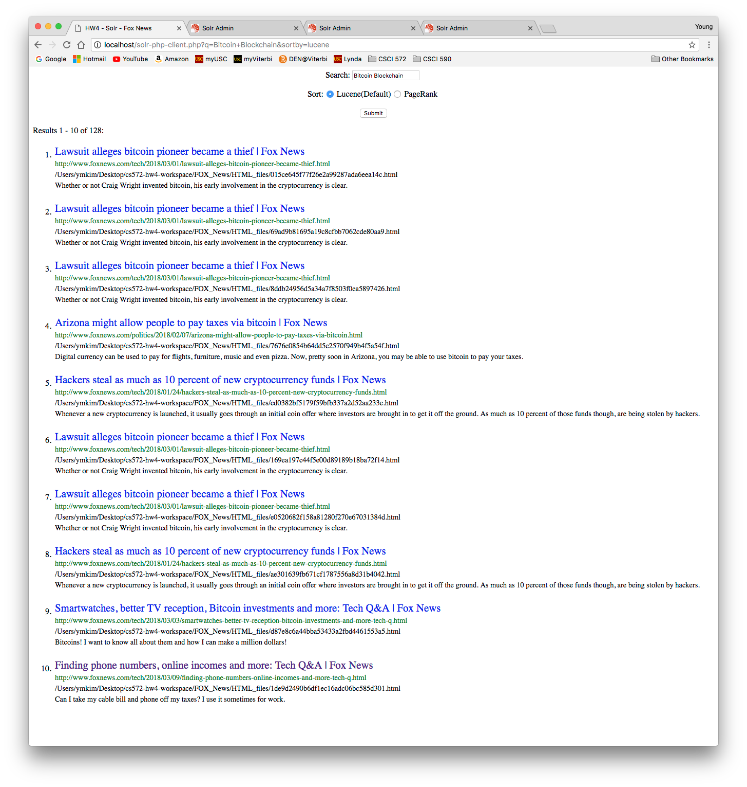
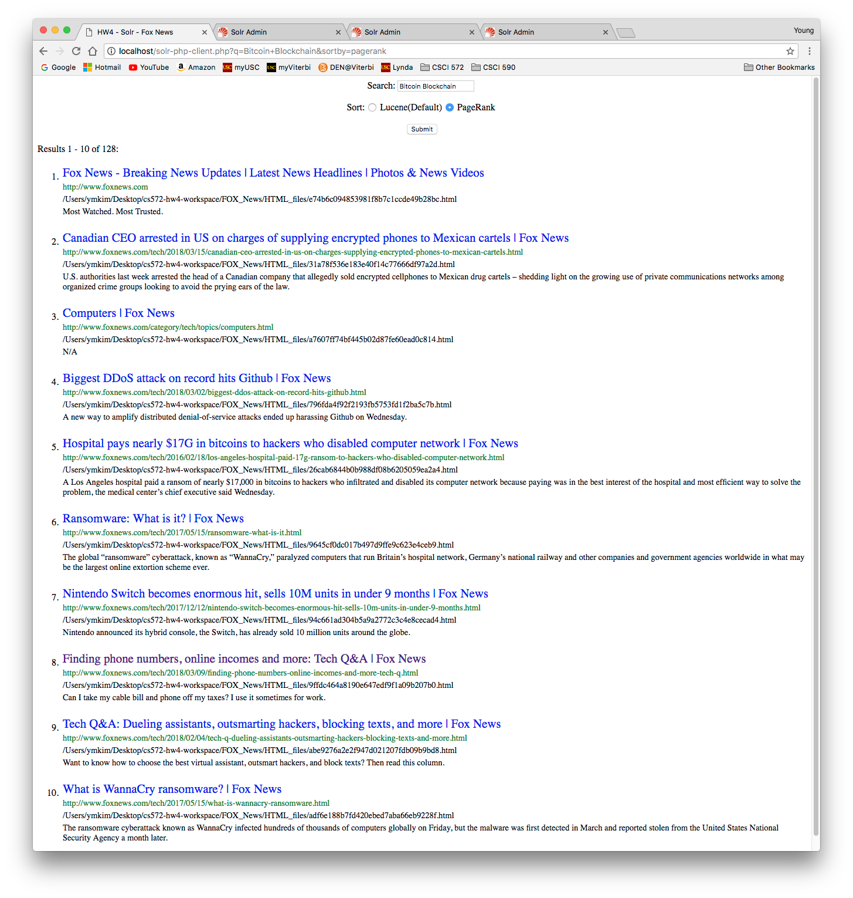

# solr-search

## Comparing Search Engine Ranking Algorithms (Solr-Lucene vs PageRank)
* Solr sever (standalone) used to index the given web pages, process query, return results
* local web sever (apache2) send query to solr server
* Solr-Lucene scoring combination of tf-idf and cosine similarity
* PageRank (computed using networkx)

### solr-php-client.php
* use solr php api to send query and receive results
* code ref: https://github.com/PTCInc/solr-php-client

### ExtractLinks.java
* using jsoup library to create edgelist.txt that represents the web graph structure 
* code ref: from example code in assignment

### pg.py
* use networkx to compute PageRank given edgelist.txt
* generates ranke file filename=page_rank_score that is added to solr 

### sample result for Lucene

### sample result for PageRank
